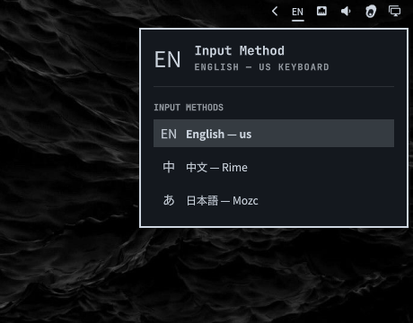

# Omarchy Input Method

Bar widget for [Omarchy](https://omarchy.org/) that shows the active [fcitx5](https://fcitx-im.org/) input method and switches it from a panel.

Labels: **中** Rime, **あ** Mozc, **EN** US keyboard / Rime ascii mode.

The Mozc section of the panel also shows and switches the composition mode
(Direct / Hiragana / Full Katakana / Full ASCII / Half ASCII / Half Katakana),
pushed live over fcitx5's kimpanel protocol — see below.



## Install

```sh
omarchy plugin add https://github.com/kazedayo/omarchy-input-method.git --enable
```

Place it:

```sh
omarchy bar move io.github.kaz.omarchy-input-method --section right
```

## Usage

- Left click: open the picker (input methods, Rime schema, ascii mode, Mozc settings)
- Right click: `fcitx5-remote -t`
- Escape: close the panel

## Mozc composition modes

Mozc (unlike Rime) exposes no D-Bus object; its composition mode lives inside
fcitx5's action framework. This plugin ships `kimpanel-bridge.py`, a small
helper that owns `org.kde.impanel` so fcitx5's kimpanel UI addon pushes the
status area (current IM + Mozc mode) to the widget, and emits
`TriggerProperty` back for mode switches.

For typing to stay unchanged (preedit/candidate windows rendered by classicui),
fcitx5 must think it's on KDE — kimpanel.cpp then delegates the input panel
back to classicui. Two user-level files set that up:

```ini
# ~/.config/systemd/user/omarchy-fcitx5.service.d/kimpanel-status.conf
[Service]
Environment=XDG_CURRENT_DESKTOP=KDE:Hyprland
```

```ini
# ~/.local/share/dbus-1/services/org.fcitx.Fcitx5.service
# Keeps dbus activation on the systemd unit so restarts don't race a bare twin.
[D-BUS Service]
Name=org.fcitx.Fcitx5
Exec=/usr/bin/fcitx5 --disable notificationitem
SystemdService=omarchy-fcitx5.service
```

then `systemctl --user daemon-reload && systemctl --user restart omarchy-fcitx5`.
Without these the widget still works, but while Mozc is active the candidate
window is routed to kimpanel and nothing renders it.

## Dependencies

Does not install these. You need them on the host:

- Omarchy Quattro (`omarchy-shell`)
- `fcitx5` and `fcitx5-remote`
- `busctl` (systemd)
- [fcitx5-rime](https://github.com/fcitx/fcitx5-rime) for 中 / schema / ascii mode
- Mozc (`/usr/lib/mozc/mozc_tool`) for あ
- `python3` with PyGObject (`gi`) for the kimpanel bridge
- font `Noto Sans CJK JP`

Other fcitx5 IMs still appear in the picker; only Rime and Mozc get extra actions.

## Remove

```sh
omarchy plugin remove io.github.kaz.omarchy-input-method
```

Does not change fcitx5 config.

## License

MIT. See [LICENSE](LICENSE).
